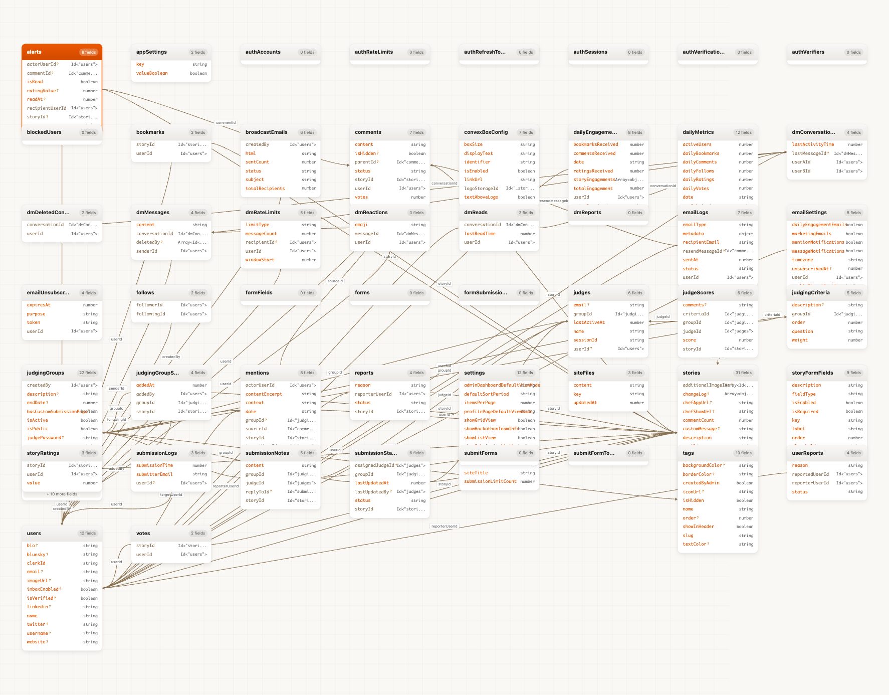

# Convex MCP Visual

Schema visualizer and dashboard tools for exploring Convex databases. Opens interactive browser UIs alongside terminal output.

**Features:**

- Schema browser with graph view, list view, and document browser
- Real-time dashboard with metrics and charts
- Mermaid ER diagrams with relationship detection
- Dark mode support
- Multi deployment support

**Three ways to use:**

| Method            | Use case                             |
| ----------------- | ------------------------------------ |
| **Direct CLI**    | Run from any terminal without MCP    |
| **MCP Server**    | Claude Code, Claude Desktop, Cursor  |
| **Claude Plugin** | Install from Claude Code marketplace |

**Convex References:**

- [Deploy Keys](https://docs.convex.dev/cli/deploy-key-types) - Authentication for deployments
- [Management API](https://docs.convex.dev/management-api) - Programmatic project management
- [Platform APIs](https://docs.convex.dev/platform-apis) - Building on Convex



## Quick Start

### Option A: Direct CLI (any terminal):

```bash
# Install globally
npm install -g convex-mcp-visual

# Setup deploy key
convex-mcp-visual --setup

# Use it
convex-mcp-visual schema      # Browse schema
convex-mcp-visual dashboard   # View metrics
convex-mcp-visual diagram     # Generate ER diagram
```

### Option B: MCP Server (Claude/Cursor/OpenCode)

```bash
# Auto-install to all MCP clients (Cursor, OpenCode, Claude Desktop)
npx convex-mcp-visual --install

# Or install to specific clients
npx convex-mcp-visual --install-cursor
npx convex-mcp-visual --install-opencode
npx convex-mcp-visual --install-claude

# Claude Code CLI (alternative)
claude mcp add convex-visual -- npx convex-mcp-visual --stdio

# Setup deploy key
npx convex-mcp-visual --setup
```

### Option C: Claude Code Plugin

```bash
# Add the marketplace
/plugin marketplace add waynesutton/convex-mcp-visual

# Install the plugin
/plugin install convex-visual@convex-visual-marketplace
```

See [Claude plugin docs](docs/files-claude-plugin.md) for details on plugin structure.

### 2. Setup Deploy Key

Run setup from your Convex project folder:

```bash
cd my-convex-app/
npx convex-mcp-visual --setup
```

The setup wizard detects your project from `.env.local` and shows which deployment to look for in the dashboard. Just copy and paste the key.

Or set the environment variable manually:

```bash
export CONVEX_DEPLOY_KEY="prod:your-deployment|your-key"
```

Get your deploy key from [dashboard.convex.dev](https://dashboard.convex.dev) under Settings > Deploy Keys.

### Multiple Convex Apps

**One-time setup for each project:**

```bash
cd my-app-1/
npx convex-mcp-visual --setup
# Paste your deploy key when prompted, it saves to .env.local
```

**Switching between apps:** Just `cd` to the project folder. The MCP server reads from that folder's `.env.local` automatically.

```bash
cd my-app-1/   # Now using my-app-1's Convex deployment
cd ../my-app-2/ # Now using my-app-2's Convex deployment
```

No need to run `--setup` again after the initial setup.

See [Convex Deploy Keys](https://docs.convex.dev/cli/deploy-key-types) for more details.

### 3. Test Connection

```bash
npx convex-mcp-visual --test
```

### 4. Use It

**MCP Commands for Claude:**

| What you say                          | Tool triggered                    |
| ------------------------------------- | --------------------------------- |
| "Show me my Convex schema"            | `schema_browser` (graph view)     |
| "What tables do I have?"              | `schema_browser` (graph view)     |
| "Browse my database"                  | `schema_browser` (graph view)     |
| "Show schema for users table"         | `schema_browser` with table param |
| "Create a dashboard for my data"      | `dashboard_view`                  |
| "Show me metrics for my app"          | `dashboard_view`                  |
| "Generate a diagram of my schema"     | `schema_diagram` (Mermaid ER)     |
| "Show me a Mermaid ER diagram"        | `schema_diagram`                  |
| "Visualize my database relationships" | `schema_diagram`                  |

All tools open an interactive browser UI and return output to the terminal. The schema browser defaults to graph view (visual diagram with table relationships).

**Schema Diagram Features:**

- Auto detects table relationships from foreign key patterns
- ASCII/Unicode output for terminal
- SVG diagram in browser with theme options
- Exportable Mermaid code

## Documentation

- [Setup Guide](docs/setup.md) - Configuration and MCP client setup
- [Tools Reference](docs/tools.md) - Parameters and keyboard shortcuts
- [Architecture](docs/architecture.md) - How it works
- [Troubleshooting](docs/troubleshooting.md) - Common issues and fixes
- [Limitations](docs/limitations.md) - Known limitations
- [Plugin Distribution](docs/deployplugin.md) - Claude Code marketplace
- [Claude Plugin Structure](docs/files-claude-plugin.md) - Plugin and marketplace files
- [User Guide: Schema Browser](docs/user-guide-schema-browser.md) - Using the schema browser
- [User Guide: Dashboard](docs/user-guide-dashboard.md) - Using the dashboard

## Configuration

### CLI Install (Recommended)

The fastest way to configure any MCP client:

```bash
# Install to all detected MCP clients
npx convex-mcp-visual --install

# Or target specific clients
npx convex-mcp-visual --install-cursor
npx convex-mcp-visual --install-opencode
npx convex-mcp-visual --install-claude
```

This automatically updates the config files for each client.

### Claude Desktop (Manual)

Add to `~/Library/Application Support/Claude/claude_desktop_config.json`:

```json
{
  "mcpServers": {
    "convex-visual": {
      "command": "npx",
      "args": ["convex-mcp-visual", "--stdio"],
      "env": {
        "CONVEX_DEPLOY_KEY": "prod:your-deployment|your-key"
      }
    }
  }
}
```

### Cursor / VS Code (Manual)

Add to `~/.cursor/mcp.json`:

```json
{
  "mcpServers": {
    "convex-visual": {
      "command": "npx",
      "args": ["convex-mcp-visual", "--stdio"]
    }
  }
}
```

### OpenCode (Manual)

Add to `~/.config/opencode/opencode.json`:

```json
{
  "mcp": {
    "convex-visual": {
      "command": "npx",
      "args": ["convex-mcp-visual", "--stdio"]
    }
  }
}
```

## CLI Reference

### MCP Client Install Commands

```bash
# Install to MCP clients (updates config files automatically)
npx convex-mcp-visual --install           # All detected clients
npx convex-mcp-visual --install-cursor    # Cursor only
npx convex-mcp-visual --install-opencode  # OpenCode only
npx convex-mcp-visual --install-claude    # Claude Desktop only

# Uninstall from MCP clients
npx convex-mcp-visual --uninstall         # All clients
npx convex-mcp-visual --uninstall-cursor  # Cursor only
```

### Direct CLI Commands

```bash
convex-mcp-visual schema               # Browse schema in graph view (default)
convex-mcp-visual schema --graph       # Explicitly open graph view
convex-mcp-visual schema --list        # Browse schema in list view
convex-mcp-visual schema --table users # Focus on specific table
convex-mcp-visual schema --json        # JSON output only

convex-mcp-visual dashboard            # View metrics dashboard

convex-mcp-visual diagram              # Generate Mermaid ER diagram
convex-mcp-visual diagram --theme dracula
convex-mcp-visual diagram --ascii      # ASCII output for terminal
```

### MCP Server Options

```
convex-mcp-visual [options]

MCP Client Install:
  --install            Install to all MCP clients
  --install-cursor     Install to Cursor
  --install-opencode   Install to OpenCode
  --install-claude     Install to Claude Desktop
  --uninstall          Remove from all MCP clients

Server Options:
  --stdio              Run in stdio mode (default for MCP)
  --http               Run in HTTP mode
  --port <num>         Port for HTTP mode (default: 3001)
  --deployment <name>  Connect to specific deployment
  --test               Test Convex connection
  --setup              Interactive setup wizard
  --config             Show all detected config sources
  -v, --version        Show version number
  -h, --help           Show help
```

## Upgrading

```bash
# Check your current version
npx convex-mcp-visual --version

# If using npx, you get the latest version automatically
npx convex-mcp-visual@latest --version

# If installed globally, update with
npm update -g convex-mcp-visual
```

## Uninstalling

```bash
# Remove from all MCP clients
npx convex-mcp-visual --uninstall

# Or remove from specific clients
npx convex-mcp-visual --uninstall-cursor
npx convex-mcp-visual --uninstall-opencode
npx convex-mcp-visual --uninstall-claude

# Remove from Claude Code (alternative)
claude mcp remove convex-visual

# Remove global package
npm uninstall -g convex-mcp-visual
```

## Contributing

See [Development](docs/architecture.md) for build instructions.

```bash
git clone https://github.com/waynesutton/convex-mcp-visual.git
cd convex-mcp-visual
npm install
npm run build
```

## License

MIT
